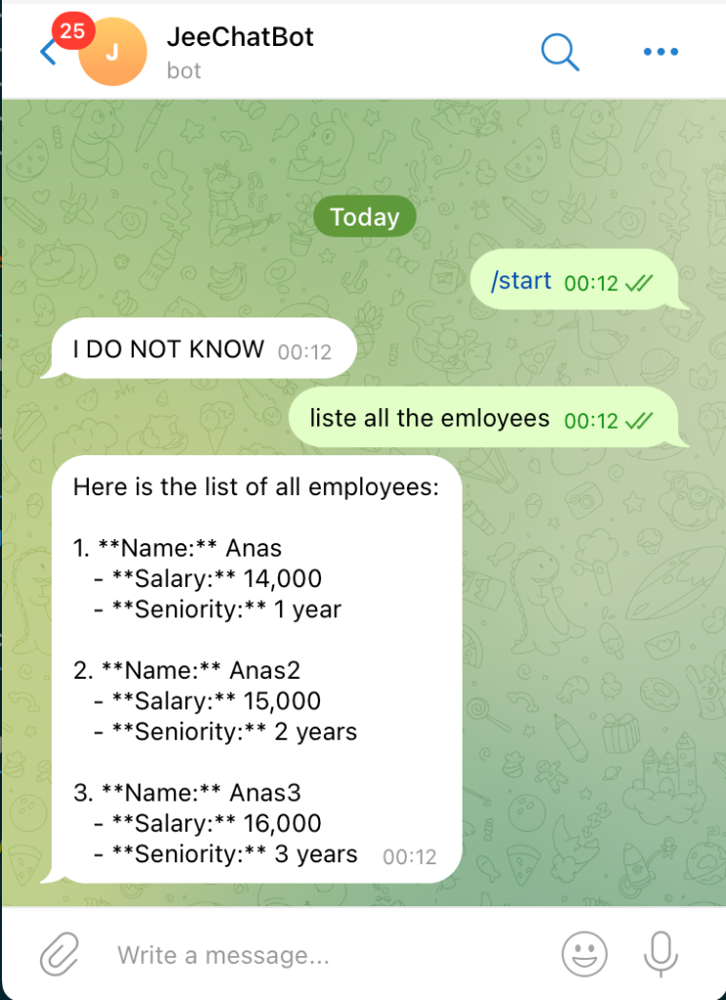

# JeeChatBot 🤖

An AI-powered chatbot built with **Spring Boot** and **Spring AI**, integrated with **Telegram** for seamless conversational experiences. This bot leverages OpenAI's GPT models and supports custom tools via the Model Context Protocol (MCP).

## 📸 Demo



## ✨ Features

- **AI-Powered Responses** – Uses OpenAI GPT-4o for intelligent conversations
- **Telegram Integration** – Full Telegram bot support with typing indicators
- **Chat Memory** – Maintains conversation context across messages
- **Custom Tools** – Extensible tool system via Spring AI
- **MCP Client Support** – Model Context Protocol for external tool integration
- **REST API** – HTTP endpoint for chat interactions

## 🛠️ Tech Stack

| Technology | Version |
|------------|---------|
| Java | 17 |
| Spring Boot | 3.5.8 |
| Spring AI | 1.1.0-M4 |
| Telegram Bots | 6.9.7.1 |

## 📁 Project Structure

```
src/main/java/org/anas/chat_bot/
├── ChatBotApplication.java      # Main application entry point
├── agents/
│   └── AiAgent.java             # AI agent with chat memory and tools
├── config/
│   └── ChatConfig.java          # Spring configuration for chat memory
├── telegram/
│   └── TelegramBot.java         # Telegram bot integration
└── web/
    └── ChatController.java      # REST API controller
```

## ⚙️ Configuration

Create or update `src/main/resources/application.properties`:

```properties
spring.application.name=chat_bot
server.port=8087

# OpenAI Configuration
spring.ai.openai.api-key=${OPENAI_API_KEY}
spring.ai.openai.chat.options.model=gpt-4o

# Telegram Configuration
telegram.api.key=${TELEGRAM_BOT_TOKEN}
```

### Environment Variables

Set these environment variables before running:

```bash
export OPENAI_API_KEY=your-openai-api-key
export TELEGRAM_BOT_TOKEN=your-telegram-bot-token
```

## 🚀 Getting Started

### Prerequisites

- Java 17+
- Maven 3.9+
- OpenAI API key
- Telegram Bot Token (from [@BotFather](https://t.me/botfather))

### Build & Run

```bash
# Clone the repository
git clone <repository-url>
cd chat_bot

# Build the project
mvn clean install

# Run the application
mvn spring-boot:run
```

## 📡 API Endpoints

### Chat Endpoint

```
GET /chat?querry={your-message}
```

**Example:**
```bash
curl "http://localhost:8087/chat?querry=Hello"
```

## 🤖 Telegram Bot Usage

1. Search for your bot on Telegram (e.g., `@JeeChatBot`)
2. Start a conversation with `/start`
3. Ask any question!

The bot will show a "typing" indicator while processing your request.

## 🔧 Adding Custom Tools

Create a new tool class in `org.anas.chat_bot.tools`:

```java
@Component
public class MyCustomTools {
    
    @Tool(description = "Description of what this tool does")
    public String myTool(@ToolParam(description = "Parameter description") String param) {
        // Tool implementation
        return "Result";
    }
}
```

## 📝 License

This project is for educational purposes.

## 👨‍💻 Author

**Anas** - JEE Microservices Course
